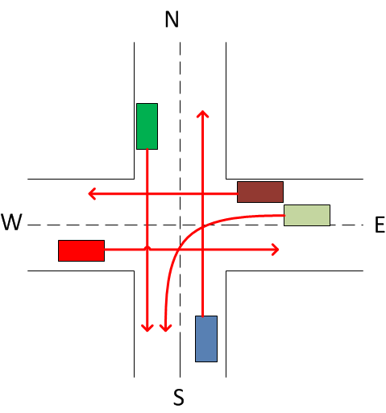

# Многопоточное моделирование перекрестка с интеллектуальным светофором

Данное приложение эмулирует работу интеллектуального светофора на перекрестке с четырьмя направлениями движения: N (Север), W (Запад), S (Юг), E (Восток). Автомобили подъезжают к перекрестку и встают в очередь. Светофор разрешает движение группам машин, траектории которых не пересекаются. Модель перекрестка с возможными направлениями движения автомобилей представлена на рисунке: 



## Основные компоненты программы:
- **Direction**: Перечисление, представляющее возможные направления движения автомобилей.
- **Car**: Класс, представляющий автомобиль, который движется в определенном направлении и взаимодействует со светофором.
- **TrafficLight**: Класс, представляющий интеллектуальный светофор, который управляет движением автомобилей на перекрестке.
- **Main**: Основной класс, который запускает симуляцию перекрестка.
- **TrafficLightTest**: Класс для тестирования приложения.

## Основные функции:
- **Синхронизация потоков**: Приложение использует семафор (`Semaphore`) и блокировки (`synchronized`) для управления доступом к общим ресурсам и предотвращения race conditions.
- **Интеллектуальное управление светофором**: Светофор разрешает движение только тем автомобилям, траектории которых не пересекаются.
- **Многопоточность**: Каждый автомобиль работает в отдельном потоке, что позволяет моделировать одновременное движение машин.
- **Тестирование**: Приложение включает тесты для проверки корректности работы светофора и отсутствия deadlocks и race conditions.

## Структура проекта: 
```
├──src/
│  ├──main/java
│  │  └──ru.spbstu.telematics.java
│  │     ├── Direction.java          # Перечисление направлений движения
│  │     ├── Car.java                # Класс автомобиля
│  │     ├── TrafficLight.java       # Класс светофора
│  │     └── Main.java               # Главный класс
│  │  
│  └──test/java
│     └──ru.spbstu.telematics.java
│        └── TrafficLightTest.java   # Тесты
│
├──.gitignore
├──model.png
├──pom.xml
└──README.md
```

## Запуск проекта

Для запуска проекта необходимо выполнить следующие шаги:

1. Клонируйте репозиторий с проектом:
   ```bash
   git clone <repository-url>
2. Перейдите в директорию проекта:
    ```bash
    cd <project-directory>
3. Соберите проект с помощью Maven:
    ```bash
    mvn clean install 
4. Запустите основное приложение: 
    ```bash
    mvn exec:java
5. Для запуска тестов выполните:
    ```bash
    mvn test 

## Тестирование
Проект включает два основных теста:

**testNoDeadlock:** Проверяет, что в приложении не возникает deadlock. Тест создает 50 автомобилей и проверяет, что все потоки завершаются корректно.

**testRaceCondition:** Проверяет, что все автомобили успешно проезжают перекресток без race conditions. Тест создает 100 автомобилей и проверяет, что количество проехавших машин соответствует ожидаемому.